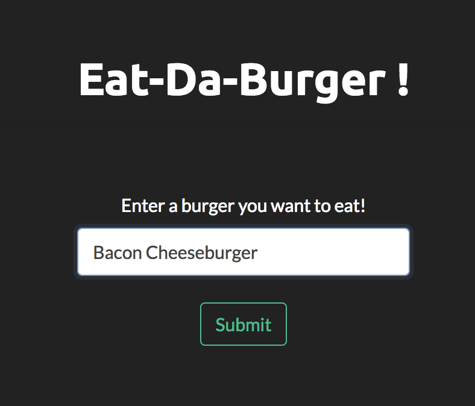

# Burger Addiction

### A burger logger with MySQL, Node, Express, Handlebars, and Sequelize library.

### Give it a try here: [Burger Addiction](LINK)

### This app are three major utilities:

* Submit your burger cravings.

* Add as many as you want!

* Mark the burgers as devoured when eaten:

* Clear the eaten burger from your page:

#### Enjoy!
